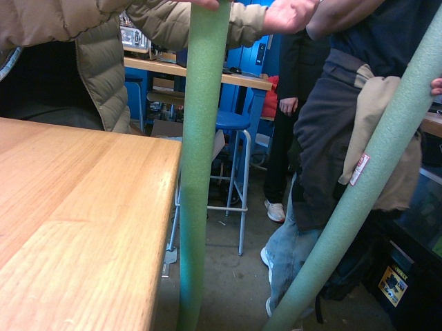

# RealSense Data Collection Pipeline

ROS 2 Foxy pipeline for Intel RealSense D455 depth camera with real-time visualization and automated dataset collection. Built for underwater object detection training data collection.



## Architecture

This repository contains three separate packages:

1. **realsense_d455_publisher** - C++ publisher node using RealSense SDK for hardware camera access
2. **realsense_subscriber** - Python subscriber node for real-time visualization with distance analysis
3. **realsense_data_collector** - Standalone Python script for automated dataset capture (NO ROS2 required)

## Key Features

- Synchronized color and depth streaming at 30 FPS (640×480 or 1280×720)
- Real-time closest object detection and center point distance tracking
- Multiple collection modes: time-based, motion-triggered, manual, continuous
- Automatic metadata generation with depth statistics
- Underwater color correction and enhancement
- Blur detection and quality filtering
- Direct SDK integration (no realsense-ros wrapper dependency)

## Quick Start

### Option 1: ROS2 Pipeline (Publisher + Subscriber)

```bash
# Terminal 1: Start camera publisher
cd ~/ros2_ws
source install/setup.bash
ros2 launch realsense_d455_publisher realsense_publisher.launch.py

# Terminal 2: Visualize with distance overlay
ros2 launch realsense_subscriber subscriber.launch.py
```

### Option 2: Standalone Dataset Collector (No ROS2)

```bash
# Collect dataset directly from camera (NO ROS2 required)
python3 underwater_dataset_collector.py --mode time_based --interval 3.0
```

## Installation

### Prerequisites

```bash
# Install RealSense SDK 2.0
sudo mkdir -p /etc/apt/keyrings
curl -sSf https://librealsense.intel.com/Debian/librealsense.pgp | sudo tee /etc/apt/keyrings/librealsense.pgp > /dev/null
echo "deb [signed-by=/etc/apt/keyrings/librealsense.pgp] https://librealsense.intel.com/Debian/apt-repo `lsb_release -cs` main" | \
sudo tee /etc/apt/sources.list.d/librealsense.list
sudo apt update
sudo apt install librealsense2-dkms librealsense2-utils librealsense2-dev

# Verify camera connection
realsense-viewer

# Install Python dependencies
pip3 install pyrealsense2 opencv-python numpy

# ROS 2 dependencies (only if using ROS2 pipeline)
sudo apt install ros-foxy-cv-bridge python3-opencv
```

### Build ROS2 Packages

```bash
# Clone repository
cd ~/ros2_ws/src
git clone https://github.com/EraOfCoding/RealSense-Data-Collection-Pipeline.git

# Build all packages
cd ~/ros2_ws
colcon build

# Source workspace
source install/setup.bash

# Verify packages are found
ros2 pkg list | grep realsense
```

**Expected output:**
```
realsense_d455_publisher
realsense_subscriber
```

## Data Collection Modes

### Standalone Dataset Collector (Recommended)

**No ROS2 required** - Direct camera access with underwater optimization

```bash
# Time-based: Capture every N seconds
python3 underwater_dataset_collector.py --mode time_based --interval 3.0

# Motion-triggered: Capture when movement detected
python3 underwater_dataset_collector.py --mode motion --motion-threshold 5000

# Manual: Press 's' to save interesting frames
python3 underwater_dataset_collector.py --mode manual

# Continuous: Save every frame
python3 underwater_dataset_collector.py --mode continuous --output /mnt/external/dataset
```

**Keyboard controls during collection:**
- `s` - Save current frame manually
- `c` - Toggle underwater color correction
- `u` - Increase camera exposure
- `d` - Decrease camera exposure
- `r` - Toggle red channel compensation
- `e` - Toggle enhancement preview
- `q` - Quit and save metadata

**Output structure:**
```
underwater_dataset/
└── session_20240122_143052/
    ├── images/           # Color images (JPG, 95% quality)
    │   ├── img_000001.jpg
    │   ├── img_000002.jpg
    │   └── ...
    ├── depth/            # Depth maps (PNG, 16-bit lossless)
    │   ├── depth_000001.png
    │   ├── depth_000002.png
    │   └── ...
    ├── annotations/      # Empty files ready for labeling
    │   ├── img_000001.txt
    │   └── ...
    ├── metadata.json     # Complete session metadata
    └── README.txt        # Human-readable summary
```

### ROS2-based Collection

If you need to integrate with existing ROS2 systems:

```bash
# Make sure publisher is running first
ros2 launch realsense_d455_publisher realsense_publisher.launch.py

# Then run subscriber/collector
ros2 launch realsense_subscriber subscriber.launch.py
```

## Visualization Features

The subscriber node provides:
- **Green crosshair**: Center point distance measurement
- **Red crosshair**: Closest object in frame with distance
- **Real-time statistics**: Min/max/mean depth across entire frame
- **Colormap rendering**: Jet colormap for depth visualization
- **Synchronized display**: Side-by-side color and depth views

## ROS Topics

| Topic | Type | Format | Rate |
|-------|------|--------|------|
| `/camera/color/image_raw` | sensor_msgs/Image | BGR8 (3 channels) | 30 Hz |
| `/camera/depth/image_raw` | sensor_msgs/Image | 16UC1 (millimeters) | 30 Hz |
| `/camera/color/camera_info` | sensor_msgs/CameraInfo | Intrinsics + distortion | 30 Hz |

**Depth encoding:** 16-bit unsigned integer where each pixel value represents distance in millimeters (0-65535mm range, 0 = invalid).

## Package Details

### 1. realsense_d455_publisher (C++)

**Location:** `src/realsense_d455_publisher/`

**Files:**
```
├── CMakeLists.txt
├── package.xml
├── src/
│   └── realsense_publisher.cpp
└── launch/
    └── realsense_publisher.launch.py
```

**Purpose:** Captures data from RealSense D455 camera hardware and publishes to ROS2 topics.

**Build type:** `ament_cmake`

### 2. realsense_subscriber (Python)

**Location:** `src/realsense_subscriber/`

**Files:**
```
├── package.xml
├── setup.py
├── setup.cfg
├── resource/
│   └── realsense_subscriber
├── realsense_subscriber/
│   ├── __init__.py
│   └── realsense_subscriber.py
└── launch/
    └── subscriber.launch.py
```

**Purpose:** Subscribes to camera topics and displays real-time visualization with distance analysis.

**Build type:** `ament_python`

### 3. underwater_dataset_collector.py (Standalone)

**Location:** `standalone_scripts/underwater_dataset_collector.py`

**Purpose:** Direct camera access for dataset collection without ROS2 overhead. Includes underwater-specific features:
- Automatic color correction for blue/green water tint
- Red channel compensation for light absorption
- CLAHE contrast enhancement
- Gamma correction for brightness
- Blur detection and filtering
- Motion-based and time-based capture modes

**Dependencies:** `pyrealsense2`, `opencv-python`, `numpy` (NO ROS2 required)

## Troubleshooting

### Publisher won't start

```bash
# Check camera connection (must be USB 3.0)
lsusb | grep Intel
realsense-viewer

# Check permissions
sudo usermod -a -G video $USER
# Log out and back in

# Rebuild package
cd ~/ros2_ws
colcon build --packages-select realsense_d455_publisher --cmake-clean-cache
```

### Subscriber not finding package

```bash
# Source the correct workspace
cd ~/ros2_ws
source install/setup.bash

# Verify packages exist
ros2 pkg list | grep realsense

# Check if wrong workspace is sourced
echo $AMENT_PREFIX_PATH
```

### Standalone collector errors

```bash
# Verify RealSense SDK is installed
python3 -c "import pyrealsense2 as rs; print(rs.__version__)"

# Check camera detection
python3 -c "import pyrealsense2 as rs; print(len(rs.context().query_devices()), 'device(s) found')"

# Install missing dependencies
pip3 install pyrealsense2 opencv-python numpy
```

---

**Stack:** ROS 2 Foxy | C++14 | Python 3.8 | OpenCV 4 | Intel RealSense SDK 2.54+  
**Tested on:** Ubuntu 20.04 LTS with RealSense D455  
**Maintained by:** UBC Subbots Autonomous Underwater Vehicle Team