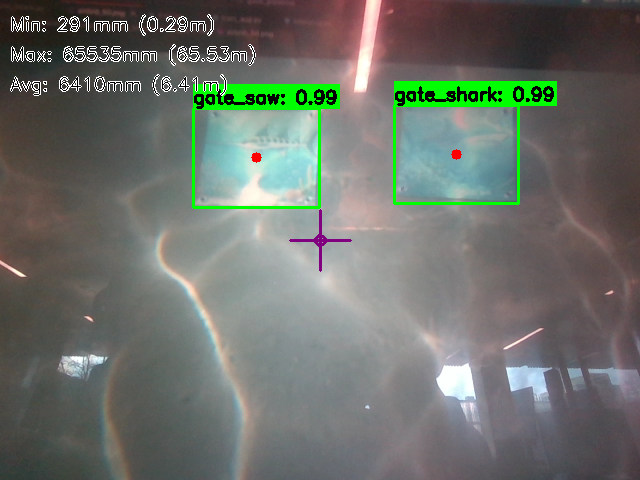

# RealSense Data Collection Pipeline

A ROS2 Foxy pipeline for real-time object detection and depth-aware data collection using the Intel RealSense D455 camera and YOLOv11.

Built for the **UBC Subbots** autonomous underwater vehicle team.

---



## Overview

This pipeline consists of two ROS2 nodes that work together:

- **`realsense_publisher`** (C++) — Interfaces directly with the RealSense D455 hardware. Streams color images, depth images, camera intrinsics, and IMU data (accelerometer + gyroscope at 200 Hz) to ROS2 topics.

- **`realsense_subscriber`** (Python) — Subscribes to those topics, runs YOLOv11 inference on each color frame, overlays bounding boxes with class labels and real-world distance measurements, and displays the result in a live OpenCV window.

Both nodes are launched together via a single launch file in the `realsense_subscriber` package.

---

## Key Features

- Live YOLO object detection with per-object distance readout (e.g. `gate: 0.91 @ 1.43m`)
- Depth statistics overlay (min/max/avg distance across the frame)
- Center crosshair with distance measurement
- Manual frame saving on keypress (`s`) organized by date
- Fully parameterized — confidence threshold, resolution, FPS, model path, and more configurable at launch

---

## Dependencies

- ROS2 Foxy
- Intel RealSense SDK 2.0 (`librealsense2`)
- `cv_bridge`, `sensor_msgs`
- OpenCV
- Python: `ultralytics`, `torch`, `numpy`, `cv2`

---

## Hardware

- Intel RealSense D455

---

## Running the Pipeline

```bash
# Source workspace
source install/setup.bash

# Launch both nodes
ros2 launch realsense_subscriber realsense.launch.py
```

### Keyboard Controls

| Key | Action |
|-----|--------|
| `s` | Save current color + depth frame |

---

## Configuration

Parameters can be edited in `realsense.launch.py`:

| Parameter | Default | Description |
|-----------|---------|-------------|
| `model_path` | `best.pt` | Path to YOLO `.pt` weights |
| `confidence_threshold` | `0.5` | Minimum detection confidence |
| `device` | `cpu` | Inference device (`cpu` or `cuda:0`) |
| `save_images` | `False` | Enable manual frame saving |
| `width` / `height` | `640x480` | Camera resolution |
| `fps` | `30` | Camera framerate |
